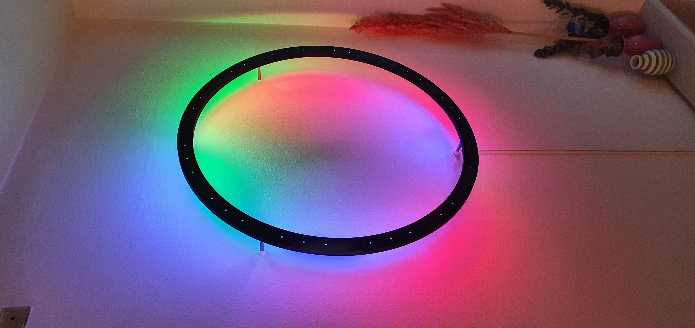

# Halo Clock Light

### Floating wall mounted ring light which can function as a clock.

<!--img src="static/images/image1.jpg" style="width: 49%; height: 600px; object-fit: cover; object-position: 0 35%;"-->

[More images](static/images)

---
## Parts list

Total price: ~30€

- [3D printed parts](./exports/)
    - 12x frame sections
    - 3x wall stud covers
- 5V 5A PSU (MeanWall RS-25-5 works well)
- Wemos D1 Mini or similar
- 8mm rods
    - 3x 80-160mm rods. (Depends on wall mounting)
- 24x M4 20mm pan head bolt
- 24x M4 hexagonal nuts
- Addressable LED strip (any 10mm wide addressable 5V LED strips)
    - 1x 233cm (corrosponds to 70 LEDs on a 30 LED/m strip)
    - 1x 213cm (corrosponds to 64 LEDs on a 30 LED/m strip)
- Wire
  - 50cm red wire (12 AWG wire)
  - 50cm black wire (12 AWG wire)
  - 50cm colored wire (12 AWG wire)
  - 100-200cm twin core cable

---
## Assembly

### Recommended tools
  - Screwdriver
  - Pliers
  - Hot glue gun
  - Solder iron
  - Wire cutter / stripper
  - Angle grinder or hacksaw
  - 8mm drill and drilling machine

### Guide
1) Assembly the frame by screwing all sections together using the screws.
   - Nuts can be placed with bare hands and can almost be tightented without using pliers.
2) Remove the adhesive from the back of the strips, as it won't stick on the plastic for long.
3) Place each LED strips on the inside walls. Attach them using hot glue on the back of the strips.
   - Recommended to start both strips from the same place.
   - Make sure to place the LEDs flat/parallel to the wall otherwise the light beam will be slightly misaligned.
4) Hot glue the Wemos D1 to the inside frame.
   - Don't forget to program the Wemos beforehand!
   - Make sure connections don't cause any shorts with contact pads on the LED strips.
5) Solder on wires for power and signals.
   - Complete the power loop by soldering wires from the end to the start of the LED strip.
   - Add cross wires on the opposite site to distribute power between the strips.
   - Solder wires to the Wemos D1 mini.
   - Solder thick wires to the LEDs strips.
6) Cut the rods into appropriate lengths.
   - Distance the frame about 7cm from the wall to get an even coverage inside the circle.

### Schematic
TODO: Graphics

1) Route the signal wire from the inner LED strip to RX (GPIO3) and from the outer LED strip to D4 (GPIO2)

---
## Software

### ESPHome
ESPHome firmware config can be found [here](./firmwares/esphome.yaml)
Light effects for clock visualizations and parallelization of LED strips are currently under development.

### Home Assitant
TODO